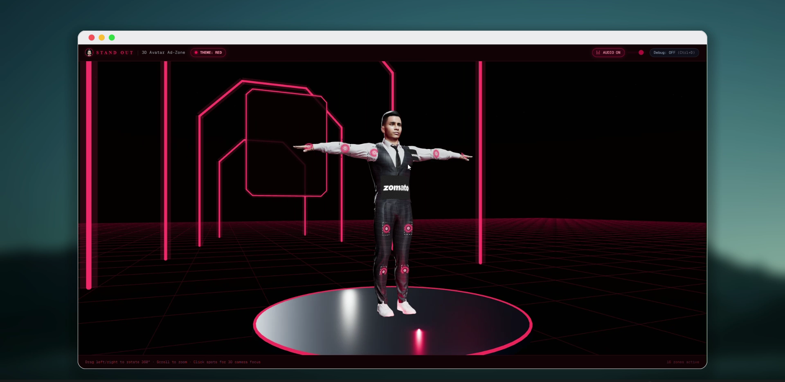
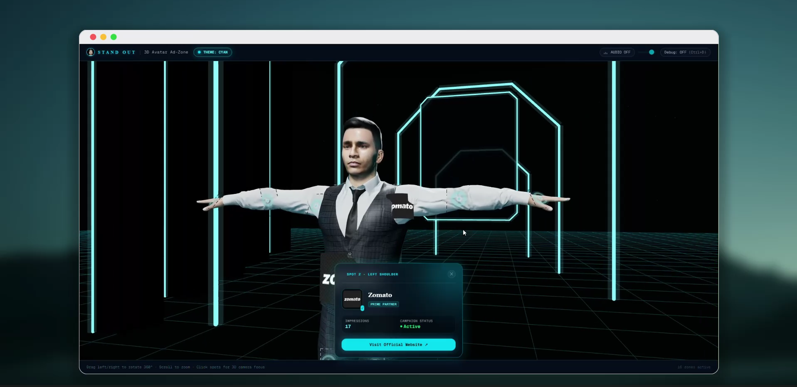
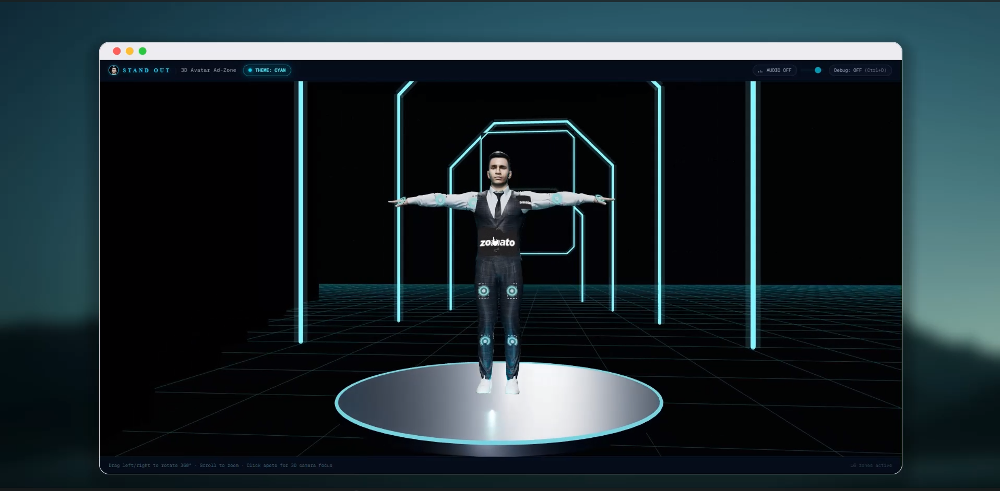

# 🧍 Standyrox

### Turn a 3D human model into interactive advertising space.

**Standyrox** is an interactive 3D advertising platform where brands can purchase specific advertising spots on a virtual human model.

The platform divides the model into **16 advertising zones**, allowing brands to select a specific body location, purchase that placement, and display their brand directly on the 3D model.

---

## 🌐 Live Demo

🚀 **[Visit Standyrox](https://standyrox.anshulx.me/)**

---

## 🎬 Product Demo

### Watch the Standyrox experience

▶️ Watch Standyrox Demo Video:LINK --> https://drive.google.com/file/d/1dhBMhAqPUijWYbi6YN1HBq4c7PjIMt9U/view?usp=drive_link

> The demo showcases the interactive 3D model, advertising spots, camera interaction, brand placement and the overall product experience.

---

## 📸 Screenshots

### 🧍 Interactive 3D Advertising Model

The main experience allows users to explore the 3D human model and interact with available advertising zones.



---

### 🏷️ Brand Advertising Spot

Each advertising zone can display a brand and campaign information after the placement has been purchased.



---

### 🎨 Interactive 3D Environment

The application uses a futuristic 3D environment with interactive advertising zones and dynamic visual themes.



---

## 💡 What is Standyrox?

Traditional advertising is usually placed on:

- Websites
- Mobile applications
- Billboards
- Social media
- Videos

Standyrox explores a different concept:

> **What if a 3D human body could become advertising space?**

The platform provides **16 purchasable advertising zones** across the virtual model.

Brands can select a specific location and purchase that placement.

Once the purchase is completed, the brand can be displayed on the selected location of the 3D model.

---

## ✨ Core Features

- 🧍 Interactive 3D human model
- 🎯 16 advertising zones
- 🏷️ Brand logo placement
- 💳 Online payment integration
- 📍 Location-based advertising spots
- 🎨 Futuristic interactive UI
- 🖱️ Clickable 3D hotspots
- 🔄 Dynamic brand placement
- 📊 Campaign information
- 📱 Responsive web experience
- 🌐 Vercel deployment

---

## 🧩 How It Works

```text
                 STANDYROX

                     │
                     ▼
              Explore 3D Model
                     │
                     ▼
              Select Body Spot
                     │
                     ▼
             View Spot Details
                     │
                     ▼
              Select / Upload Brand
                     │
                     ▼
                  Checkout
                     │
                     ▼
              Dodo Payments
                     │
                     ▼
             Payment Confirmation
                     │
                     ▼
             Spot Becomes Active
                     │
                     ▼
          Brand Appears on 3D Model
```

---

## 🧍 16 Advertising Zones

The virtual human model is divided into **16 individual advertising placements**.

Each advertising spot can represent its own advertising inventory with:

```text
Spot
 ├── Spot ID
 ├── Body Location
 ├── Price
 ├── Payment Product
 ├── Brand
 ├── Logo
 └── Campaign Status
```

This allows each location on the model to function as an individual advertising product.

---

## 💳 Payment Flow

Standyrox integrates **Dodo Payments** for the advertising checkout flow.

The selected advertising spot is validated before creating the payment checkout.

```text
User selects spot
       │
       ▼
Backend validates spot
       │
       ▼
Spot → Payment Product
       │
       ▼
Dodo Payments Checkout
       │
       ▼
Payment completed
       │
       ▼
Webhook confirmation
       │
       ▼
Advertising spot activated
       │
       ▼
Brand displayed on model
```

The application keeps the advertising spot configuration on the server instead of relying on client-provided pricing.

---

## 🧠 Architecture

Standyrox is built as a modern Next.js application with an interactive Three.js-based 3D experience.

```text
┌──────────────────────────────────┐
│            Next.js               │
│                                  │
│       React + TypeScript         │
│                │                 │
│                ▼                 │
│        Three.js / 3D             │
│                │                 │
│                ▼                 │
│       Interactive 3D Model       │
│                │                 │
│                ▼                 │
│       Advertising Hotspots       │
└────────────────┬─────────────────┘
                 │
                 ▼
┌──────────────────────────────────┐
│          Application API         │
│                                  │
│     Spot / Product Validation    │
│                │                 │
│                ▼                 │
│       Checkout Creation          │
└────────────────┬─────────────────┘
                 │
                 ▼
┌──────────────────────────────────┐
│          Dodo Payments           │
│                                  │
│             Checkout             │
│                │                 │
│                ▼                 │
│             Webhook              │
│                │                 │
│                ▼                 │
│       Payment Confirmation       │
└──────────────────────────────────┘
                 │
                 ▼
┌──────────────────────────────────┐
│             Vercel               │
│                                  │
│        Production Deployment     │
└──────────────────────────────────┘
```

---

## 🎨 3D Experience

The 3D model was created and prepared using **Blender** and integrated into the web experience using **Three.js**.

Blender is used for the 3D asset/model workflow, while Three.js handles the interactive 3D experience in the browser.

Users can:

- Rotate the model
- Zoom into the model
- Explore different angles
- Click advertising spots
- Focus the camera on selected spots
- View brand/campaign information
- Interact with purchased placements

---

## 🛠️ Technology Stack

### Frontend

- Next.js
- React
- TypeScript
- Tailwind CSS

### 3D

- Three.js
- Blender
- GLB / GLTF 3D assets

### Payments

- Dodo Payments

### Deployment

- Vercel

---

## 📁 Project Structure

```text
stand-out/
│
├── app/
│   └── Next.js application
│
├── components/
│   └── UI and 3D components
│
├── db/
│   └── Database-related code
│
├── lib/
│   └── Application utilities and services
│
├── public/
│   ├── assets/
│   │   ├── image-1.png
│   │   ├── image-2.png
│   │   ├── image-3.png
│   │   └── Stand_Out_demo.mp4
│   │
│   └── models/
│       ├── avatar-v1.glb
│       └── avatar-v11.glb
│
└── README.md
```

---

## 🔐 Payment & Product Validation

The application follows a server-controlled payment flow.

The browser provides the selected advertising spot rather than trusting the client to determine the final product configuration.

```text
Client
  │
  │ spotId
  ▼
Server
  │
  ├── Validate spot
  │
  ├── Resolve payment product
  │
  ├── Create checkout
  │
  ▼
Dodo Payments
  │
  ▼
Webhook
  │
  ▼
Confirm payment
  │
  ▼
Activate spot
```

This keeps the relationship between the advertising spot, price and payment product controlled by the application.

---

## 🎯 Product Concept

Standyrox combines several different areas of development into one product:

```text
              STANDYROX
                  │
       ┌──────────┼──────────┐
       ▼          ▼          ▼
      3D        Web       Payments
       │          │          │
       ▼          ▼          ▼
   Blender    Next.js    Dodo Payments
       │          │          │
       └──────────┼──────────┘
                  ▼
        Interactive Advertising
```

The goal is to experiment with a new form of digital advertising where brands can purchase and occupy specific locations on an interactive 3D human model.

---

## 📚 What I Learned

While building Standyrox, I explored:

- Integrating 3D models into Next.js
- Three.js camera controls
- Interactive 3D hotspots
- 3D model positioning
- Mapping UI interactions to 3D locations
- Brand placement
- Payment integration
- Payment webhook handling
- Server-side product validation
- Vercel deployment
- Building a product-oriented interface around a 3D experience

---

## 🚀 Deployment

The production application is deployed on Vercel.

### Live Application

**[https://standyrox.anshulx.me/](https://standyrox.anshulx.me/)**

---

## 🔮 Future Ideas

- 🏆 Brand leaderboard
- 📊 Campaign analytics
- 👀 Impression tracking
- 🏢 Brand dashboard
- 📅 Campaign scheduling
- 📈 Real-time campaign statistics
- 🤖 AI-assisted advertising placement
- 🧍 Multiple 3D models
- 🌐 Expanded advertising inventory

---

## 👨‍💻 Author

### Anshul Chouhan

Frontend Developer

- GitHub: [@anshul-ind](https://github.com/anshul-ind)
- LinkedIn: [Anshul Chouhan](https://linkedin.com/in/anshul5176)

---

## 📄 License

MIT License
